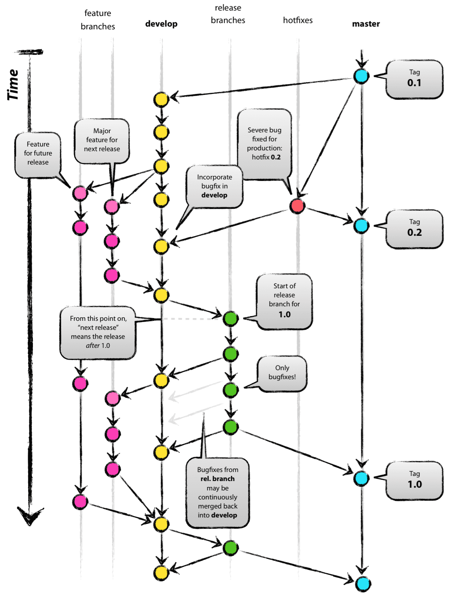

## Git flow

Git flow uses several long-lived and temporary branches:

    master: Always reflects production-ready code.
    develop: Contains the latest development work for the next release.
    feature/*: Used to create new features; branched from develop and merged back when complete.
    release/*: Prepares a new production release from develop; allows final testing and minor bug fixes.
    hotfix/*: Used to quickly patch production issues; branched from master.
